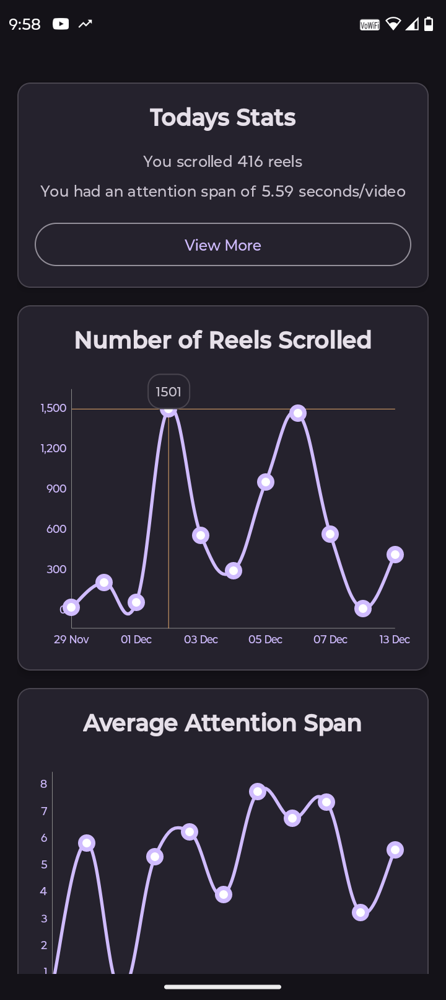
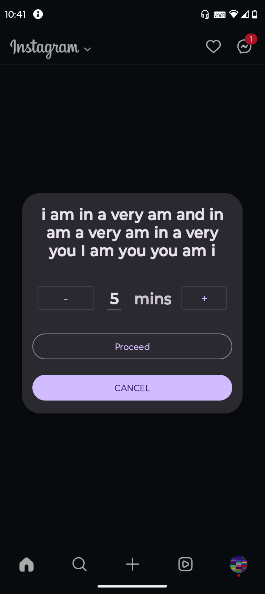
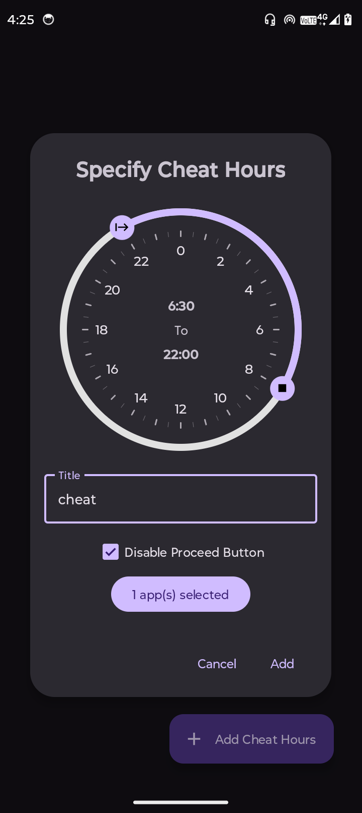
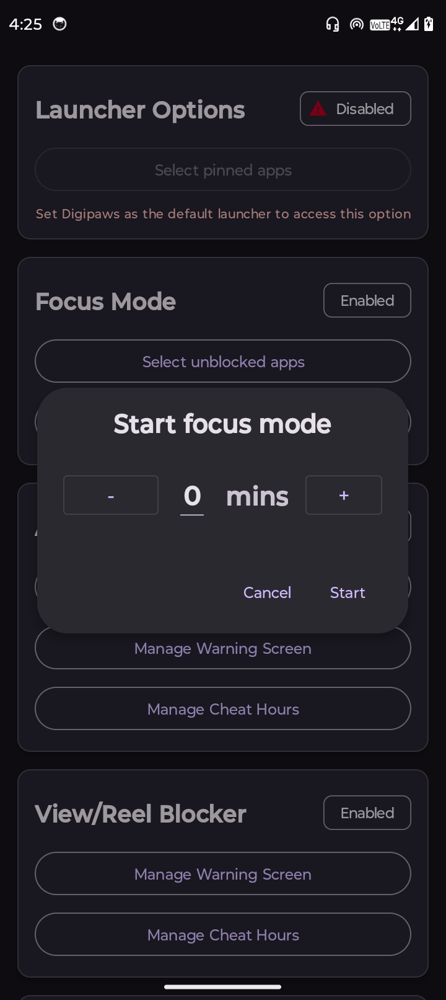
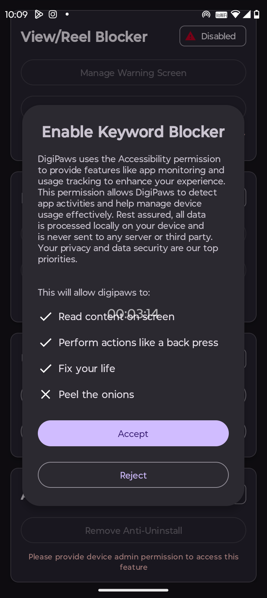

<div align="center">
  
   <h2>DigiPaws</h2>
   
   [](https://github.com/nethical6/digipaws/graphs/contributors)
   [](https://discord.com/invite/Vs9mwUtuCN)
   [](https://t.me/digipaws6)
   [](https://github.com/nethical6/digipaws/releases)
   [](https://github.com/nethical6/digipaws)
</div>


Join discord or check CI builds for beta


DigiPaws is an open-source Android productivity utility designed to help users reduce screen addiction by regulating app usage through a gamified experience. The application offers two modes namely the Base mode and the Gamified mode

> [!IMPORTANT]  
>This project is being re-written in kotlin with a new UI

> [!CAUTION]
> This project is experimental and not yet ready for full production. [Donate](https://nethical6.github.io/digipaws/donate)

> [!CAUTION]
> If you are stuck and unable to uninstall the app. You can uninstall it via the safe mode. ][How to enter safe mode](https://www.androidauthority.com/how-to-enter-safe-mode-android-801476/)


## Features

- **Gamified Challenges**: Earn coins, perform quests and more!
- **Open Source**: Fully transparent and free to use, with the source code available for community contributions.
- **Productivity Enhancement**: Helps build healthier digital habits and reduce screen addiction.
- **Versatile Blockers**: Take control of your digital environment by blocking apps, keywords, and unwanted in-app screens (e.g., YouTube shorts, comments).

## Screenshots
Click on any image to enlarge it.
<table>
	<tr>
		<td></td>
		<td></td>
		<td></td>
		<td></td>
		<td></td>
	</tr>
</table>

## Modes

### Base Mode (✅)

Allows user to configure everything as they desire according to their own needs.

### Gamified Mode (🚧🔨)

This Mode introduces a gamified experience to control screen time using various fun elements like
quests and goals. This mode tracks your usage and configures everything accordingly as the days pass
by.
> [!CAUTION]
> This mode is still in development and might take a while to release.

## Configuring

1. Launch DigiPaws on your Android device.
2. Provide all necessary permissions like Accessibility service, Notification, Draw over other apps etc
3. On Android 13+ devices, you need to additionally allow restricted settings before enabling the accessibility permission. Watch a tutorial [here](https://youtu.be/91B72lEpcqc?si=PCKKUSwM1aLdELqJ)
4. Configure the apps and views you want to block and set your preferences.
5. Start using your device with DigiPaws managing your screen time.


> [!TIP]  
> This app relies exclusively on accessibility services to function. Because it requires sensitive permissions, please avoid downloading it from untrusted sources.

## ToDo
- [x] Block reels
- [x] Block comments
- [x] Block explicit context
- [x] App blockers
- [x] Focus Quest
- [x] Anti-Uninstall
- [x] Customisable warning screen
- [ ] Quests and gamified mode
- [x] track how many tiktoks you scroll everyday 
- [x] track attention span
- [ ] Api for other developers to transform their existing apps into digipaw quests!
- [ ] Geoblocker (basically block things when a certain area is entered, like workplace)
- [x] Block custom user defined keywords
- [ ] Modular and downloadable view blockers
- [ ] expand the app to ios and desktop.
## Contributing

We welcome contributions from the community! If you'd like to contribute, please follow these steps:

1. Fork the repository.
2. Create a new branch for your feature or bugfix.
    ```sh
    git checkout -b feature/your-feature-name
    ```
3. Commit your changes.
    ```sh
    git commit -m "Add some feature"
    ```
4. Push to the branch.
    ```sh
    git push origin feature/your-feature-name
    ```
5. Create a new Pull Request.

Please ensure your code adheres to our coding standards and includes relevant tests.

Developing codes for accessibility services and blockers can be exceptionally complex and challenging to understand. This is primarily because blocking mechanisms must account for various app types, each functioning differently. Discovering these mechanisms has often required extensive app-specific debugging, coupled with trial-and-error approaches.

## Translations 
[](https://hosted.weblate.org/projects/digipaws/)
Press [here](https://hosted.weblate.org/projects/digipaws/) to help translate digipaws.


## Contributors
- [Henry Delallal](https://github.com/HenriDellal): assisted in setting up fdroid version
- [Remaker17](https://github.com/remaker17): setup workflow files
- Error 404: help

## License

DigiPaws is licensed under the [GPL 3 or later licence](LICENSE). You are free to use, modify, and distribute this software in accordance with the license.

## Contact

For questions, suggestions, or feedback, please open an issue on the [GitHub repository](https://github.com/nethical6/digipaws/issues) or contact me at:
1. Discord: @nethical
2. Telegram: @nethicalps

---

Thank you for using DigiPaws! Together, we can create healthier digital habits.
